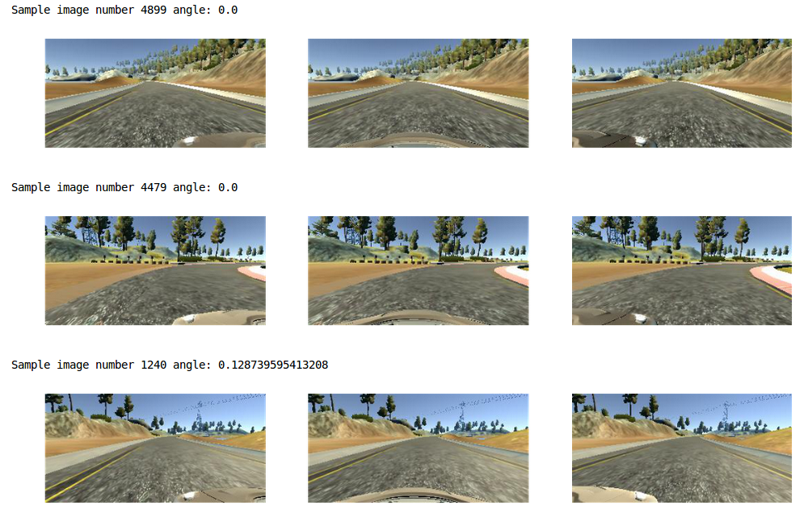
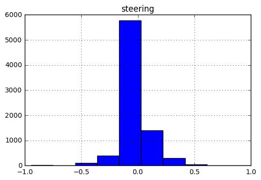
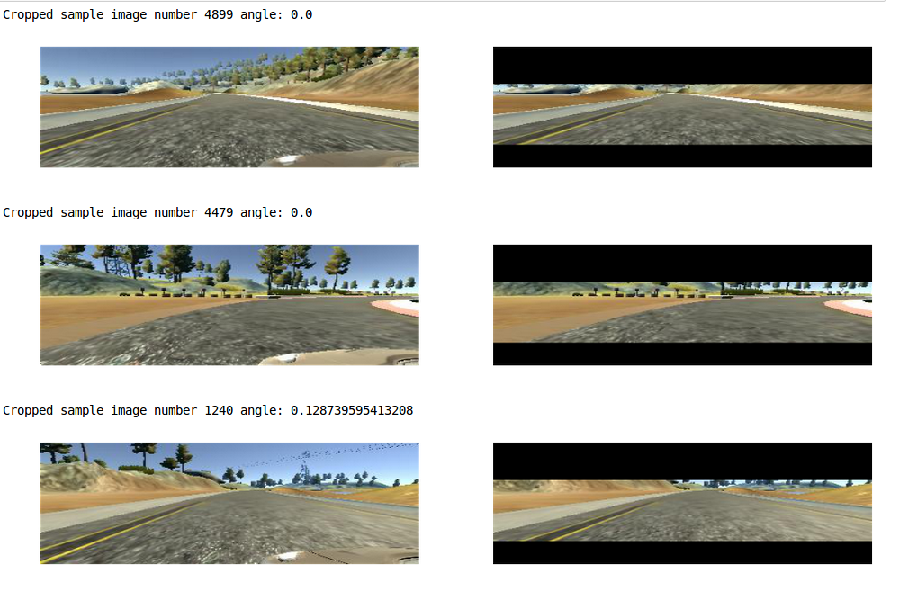
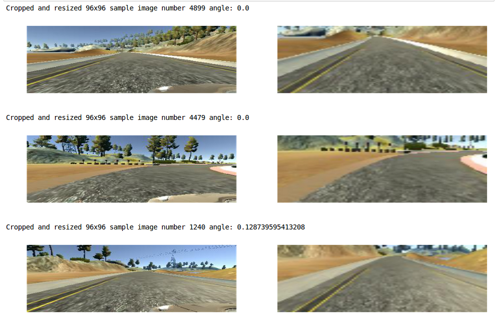
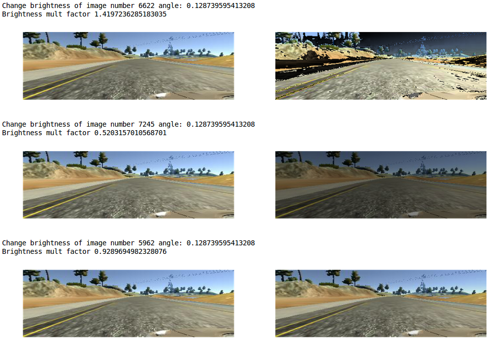

# CarND Behavioral Cloning Project
My solution of the Udacity Self-Driving Car Engineer Nanodegree Behavioral Cloning project (third project of term 1).
<br> The goal was to train a CNN based regressor that maps raw pixels from a single front-facing camera directly to steering commands.
<br> The project was inspired by the paper [End to End Learning for Self-Driving Cars
](https://arxiv.org/abs/1604.07316) from NVIDIA.
<br>**[Video of the final system](https://youtu.be/0yT9K4BF9eU)**
<br>[Official project's repo from Udacity](https://github.com/udacity/CarND-Behavioral-Cloning-P3)

## 1. Installation
In order to manage the project dependencies a Docker image has been composed starting from the [CarND-Term1-Starter-Kit](https://github.com/udacity/CarND-Term1-Starter-Kit) provided by Udacity.<br>
Clone this GitHub repository and build the [Docker](https://www.docker.com/) image:
```
$ git clone https://github.com/AndreaIncertiDelmonte/CarND-Behavioral-Cloning-Project.git
$ cd CarND-Behavioral-Cloning-Project/docker
$ docker build -t <image-name>:<image-tag> -f Dockerfile-P3.gpu .
```

The project requires also the [Udacity Simulator](https://d17h27t6h515a5.cloudfront.net/topher/2017/February/58ae46bb_linux-sim/linux-sim.zip):
```
$ cd <prg-folder>/simulator
$ wget https://d17h27t6h515a5.cloudfront.net/topher/2017/February/58ae46bb_linux-sim/linux-sim.zip
$ unzip linux-sim.zip
$ cd linux-sim
$ chmod +x linux_sim.x86_64
```

### 1.1 NVIDIA Docker
In order to access NVIDIA's GPU from a Docker container is mandatory to install the [NVIDIA Container Runtime for Docker](https://github.com/NVIDIA/nvidia-docker).
This will speed up training and inference on CNNs.

## 2. Project structure
The project has 4 main components:
- data_and_img_pipeline_inspection.ipynb
- model.py
- drive.py
- train_model_lib.py

### 2.1 data_and_img_pipeline_inspection.ipynb
This Jupyter notebook is used to inspect the [dataset](https://d17h27t6h515a5.cloudfront.net/topher/2016/December/584f6edd_data/data.zip) 
provided by Udacity and for testing the data augmentation pipeline.

#### 2.1.1 Usage
Start the Docker container and run the notebook:
 ```
$ nvidia-docker run -it --rm -v <path-on-host-pc-to-mount>:/src/term_01 -p 8888:8888 <image-name>:<image-tag> bash
$ cd <prj-folder>
$ jupyter notebook --port=8888 --allow-root --ip=0.0.0.0
```

## 2.2 model.py
The *model.py* script trains the CNN model and saves it into the *models* folder.

### 2.2.1 Usage
Start the Docker container and run the *model.py* script: 
```
$ nvidia-docker run -it --rm -v <path-on-host-pc-to-mount>:/src/term_01 -p 8888:8888 <image-name>:<image-tag> bash
$ cd <prj-folder>
$ python model.py
```

## 2.3 drive.py - inference with Udacity's simulator
Once the CNN model is ready can be combined with the [simulator](https://d17h27t6h515a5.cloudfront.net/topher/2017/February/58ae46bb_linux-sim/linux-sim.zip) 
provided by Udacity to actually control the car.

### 2.3.1 Usage
Start the simulator:
 ```
$ cd <prj-folder>/simulator/linux-sim
$ export LC_ALL="en_US.UTF-8"
$ ./linux_sim.x86_64 linux_sim_Data/
```
Then the user should select the **autonomous mode** option.
<br><br>
Start the Docker container and run the *drive.py* script:
 
 ```
$nvidia-docker run -it --rm -v <path-on-host-pc-to-mount>:/src/term_01 -p 4567:4567 <image-name>:<image-tag> bash
cd <prj-folder>
python drive.py models/<model-file>.h5
```

## 3. Udacity dataset
This [dataset](https://d17h27t6h515a5.cloudfront.net/topher/2016/December/584f6edd_data/data.zip) has been 
provided by Udacity as project resource and it has been used to train and validate the CNN model. It contains 8036 rows composed by:
- left image (jpeg 320*160)
- center image (jpeg 320*160)
- right image (jpeg 320*160)
- steering angle 

A positive steering angle corresponds to right turns, a negative one to left turns and a zero one to the car going 
straight.

Below 3 random raw samples from the dataset, images order is [LEFT, CENTER, RIGHT]:


### 3.1 Dataset download
```
$ cd <prj-folder>/udacity_data
$ wget https://d17h27t6h515a5.cloudfront.net/topher/2016/December/584f6edd_data/data.zip
$ unzip data.zip
```

### Input data quality
The dataset is heavily unbalanced, most data refers to straight driving and there are more right turns than left 
ones. <br>
The histogram computed on training data helps to visualize the problem:


## 4. Image preprocessing pipeline
Each image (training, validation and testing) goes through several preprocessing steps.

#### 4.1 Vertical crop
The first 50 pixels are removed to discard the horizon and also the last 30 ones to discard the car's bonnet.
<br>
Below the crop simulation (cropped rows are represented in black) on 3 random rows. No scaling transformation is performed. Images order is [LEFT, CENTER, RIGHT]:


#### 4.2 Resize
The images are resized to 96x96px.
Below 3 random rows cropped and resized, images order is [LEFT, CENTER, RIGHT]:


#### 4.2 Image data conversion to float and normalization
Image's pixel values are converted from int to float and then normalized between -1 and +1.

## 5. Data augmentation pipeline
To balance and augment the train and validation sets several data augmentation techniques has been applied.
This pipeline is composed by the following functions:
* camera_chooser
* horizontal_flip
* change_image_brightness

After this pipeline images pass through the *image preprocessing pipeline*.
#### 5.1 camera_chooser
**Purpose**: balance data, add more left (< 0) and right (> 0) steering angles. <br>
**Motivation**: training data histogram shows that most rows refer to straight driving (0 steering angle).<br>
To correct that has been chosen randomly witch camera image load [LEFT, CENTER, RIGHT] and then 
the steering angle has been adjusted accordingly:
* If left add +0.2
* If right add -0.2.

#### 5.2 horizontal_flip
**Purpose**: balance data, add more left data.<br>
**Motivation**: training track has more right turns than left ones.<br>
To correct this issue it has been chosen to randomly flip horizontally the images so a left image became
 a right one and vice versa. If flip occurs steering angle's sing is inverted.

#### 5.3 change_image_brightness
Purpose: make the model more robust to light variation.
Function's steps:
* image converted from RGB to HSV (Hue Saturation Brightness)
* brightness scale factor chosen randomly from 0.5 to 1.5
* image brightness channel multiplied by scale factor
* image converted back to RGB.

Below 3 random rows where the brightness change was applied, images order is [LEFT, CENTER, RIGHT]:


## 6. CNN Model
The CNN was designed following a trial and error process. 
Starting from a simple structure and then adding layers and tuning hyper parameters.

### 6.1 Network structure
The network has a classical structure composed by a convolutional encoder followed by fully connected layers. To reduce dimension of the filter 2 max poling layers have been added into the encoder while a dropout layer 
follows the first 2 fully connected layers to increase robustness. Finally ReLU has been chosen as 
activation function.

#### Scheme of the network:
|Layer (type)                   |Output Shape        |Params     |Connected to|                  
|-------------------------------|--------------------|-----------|------------|
|Conv2d_1 (Convolution2D)       |(None, 48, 48, 32)  |896        |convolution2d_input_1[0][0]|
|ReLU_1 (Activation)            |(None, 48, 48, 32)  |0          |Conv2d_1[0][0]     |     
|MaxPool_1 (MaxPooling2D)       |(None, 24, 24, 32)  |0          |ReLU_1[0][0]       |     
|Conv2d_1 (Convolution2D)       |(None, 12, 12, 64)  |18496      |MaxPool_1[0][0]     |      
|ReLU_2 (Activation)            |(None, 12, 12, 64)  |0          |Conv2d_1[0][0]    |         
|MaxPool_2 (MaxPooling2D)       |(None, 6, 6, 64)    |0          |ReLU_2[0][0]       |      
|Conv_2d_3 (Convolution2D)      |(None, 6, 6, 128)   |73856      |MaxPool_2[0][0]     |        
|ReLU_3 (Activation)            |(None, 6, 6, 128)   |0          |Conv2d_3[0][0]    |
|Flatten_4 (Flatten)            |(None, 4608)        |0          |ReLU_3[0][0]       |        
|Dropout_4 (Dropout)            |(None, 4608)        |0          |Flatten_4[0][0]          |       
|Dense_5 (Dense)                |(None, 128)         |589952     |Dropout_4[0][0]          |        
|ReLU_5 (Activation)            |(None, 128)         |0          |Dense_5[0][0]            |        
|Dropout_5 (Dropout)            |(None, 128)         |0          |ReLU_5[0][0]       |        
|Dense_6 (Dense)                |(None, 128)         |16512      |Dropout_5[0][0]          |       
|Dense_7 (Dense)                |(None, 1)           |129        |Dense_6[0][0]		  |
Total params: 699,841<br>
Trainable params: 699,841<br>
Non-trainable params: 0

### 6.2 Optimizer and error metric
This model adopts Adam as optimizer and mean square error as error metric.

### 6.3 Training params
- TRAINING_DATA_DIR = "./udacity_data/"
- TRAINING_DATA_CSV = "driving_log.csv"
- MODEL_FILE = "models/model_custom_96x96_second_submit_relu.h5"
- TRAINING_VALIDATION_SPILT = 0.8 = 80% of the data are used for training set 20% for validation set
- BATCH_SIZE = 32
- SAMPLES_PER_EPOCH = 25000 = training samples generated per epochs
- NB_EPOCHS = 3 = training epochs
- NB_VAL_SAMPLES = 5000 = validation samples generated per epochs
- LEARNING RATE = 0.0001

### 6.4 Training results
Loss: 0.0166 - val_loss: 3.7904e-05

### 6.5 Other network tested
[CommaAI network](https://github.com/commaai/research/blob/master/train_steering_model.py) has also been tested with input shape 128x128.
The obtained model was not able to drive the car properly probably due to underfitting.

## 7. Results
The model *model_custom_96x96_second_submit_relu.h5* was able to successfully drive the car in the train track.
Here a **[video of the final system](https://youtu.be/0yT9K4BF9eU)**

## Conclusion
The data augmentation process was able to compensate well the two major issues of the given training data:
* limited size
* unbalancement.